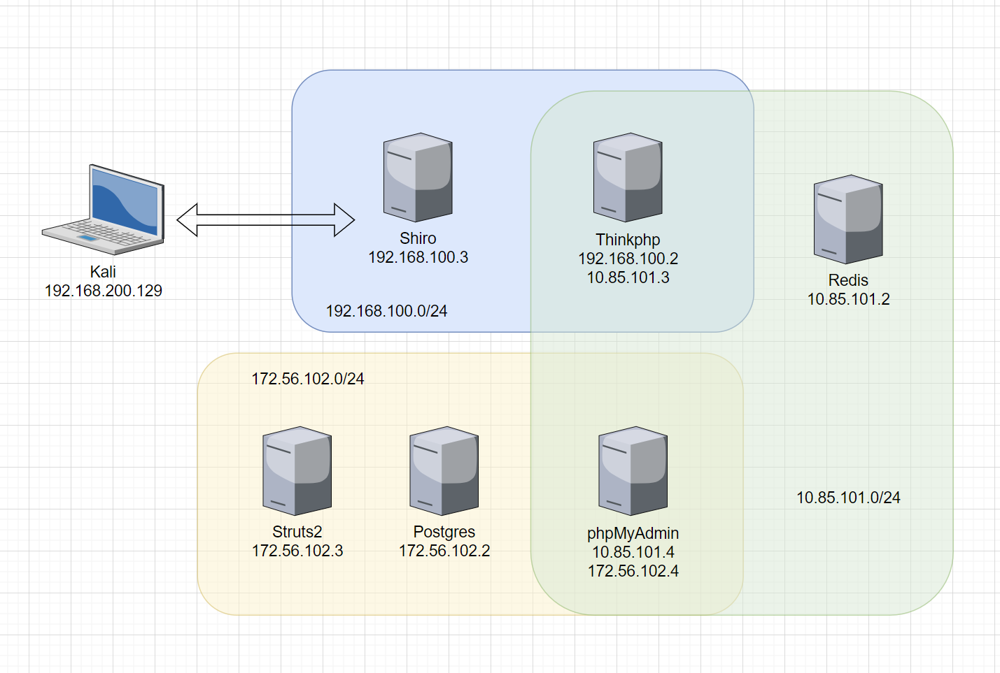

# Puff-Pastry

复现过程 [Puff-Pastry | Target Machines WriteUp](https://tryhackmyoffsecbox.github.io/Target-Machines-WriteUp/docs/Independent-Environment/Puff-Pastry/)

## 环境部署注意事项

> 由于在 docker-compose.yml 文件中指定了网络网段，所以如果发生网段冲突，请手动修改 docker-compose.yml 中各个网络的网段设置

## 环境结构总览

每个容器的 ip 地址可能会变化，但是网段是写死在 compose 文件中的

## 单环境介绍

### web - shiro

本靶机漏洞编号为：CVE-2016-4437，即 Apache Shiro 1.2.4 反序列化漏洞

环境参考 Vulhub 的示例环境：[vulhub/shiro/CVE-2016-4437 - Github](https://github.com/vulhub/vulhub/tree/master/shiro/CVE-2016-4437)，并针对多层内网的渗透场景，为了降低难度，而额外增加了以下软件包：python3 net-tools curl wget

可以直接使用 Metasploit、Shiro 反序列化工具等直接进行攻击，并反弹 shell，flag 位于 `/flag` 中

### web-thinkphp

本靶机漏洞为：ThinkPHP5 5.0.22/5.1.29 远程代码执行漏洞

环境参考 Vulhub 的示例环境：[vulhub/thinkphp/5-rce - Github](https://github.com/vulhub/vulhub/blob/master/thinkphp/5-rce/README.zh-cn.md)，并针对多层内网的渗透场景，为了降低难度，而额外增加了以下软件包：python3 net-tools curl wget

可以直接使用 ThinkPHP RCE 工具等直接进行攻击，并反弹 shell，flag 位于 `/flag` 中

### db-redis

本靶机为一个正常的 Redis 服务，配置了密码为：`123456` 的弱口令，可以使用常规的漏扫发现出来

直接连接即可，也可通过 `web-thinkphp` 靶机上传 webshell，利用蚁剑等工具进行连接，flag 位于数据库内

### service-phpmyadmin

本服务为一个正常的 phpmyadmin 服务，mysql 的凭据为 `root:root`，可以使用常规的漏扫发现出来

数据库的主机名为 `localhost`

连接到 phpmyadmin 的后台，通过日志的方式写入 webshell，即可反弹出来 shell，进行后续操作，flag 位于数据库内，以及`/flag`

### web-struts2

本靶机漏洞编号为：CVE-2018-11776，即 Struts2 S2-057 远程代码执行漏洞

环境使用 Vulhub 的示例环境：[vulhub/struts2/s2-057 - Github](https://github.com/vulhub/vulhub/tree/master/struts2/s2-057)

可以直接使用 Metasploit、struts2 反序列化工具等直接进行攻击，并反弹 shell，flag 位于 `/flag` 中

### db-postgresql

本靶机为一个正常的 Postgresql 服务，配置了密码为：`123456` 的弱口令，可以使用常规的漏扫发现出来

直接连接即可，也可通过 `web-struts2` 靶机上传 webshell，利用蚁剑等工具进行连接，flag 位于数据库内
